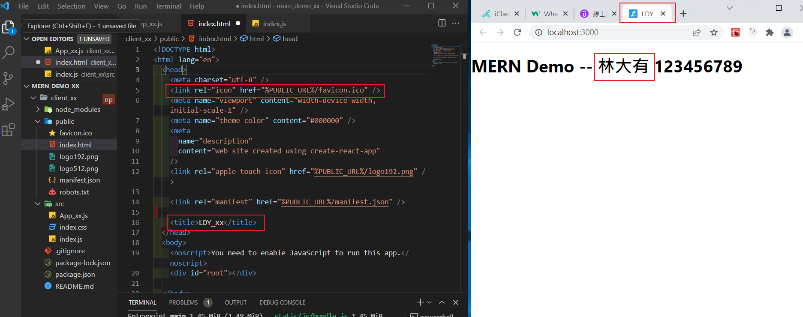
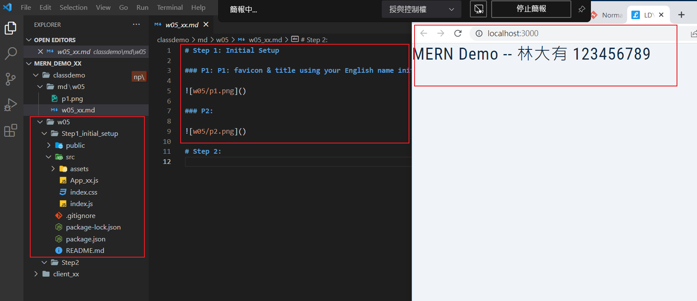
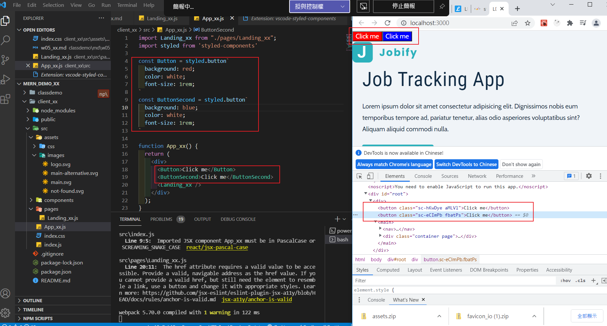
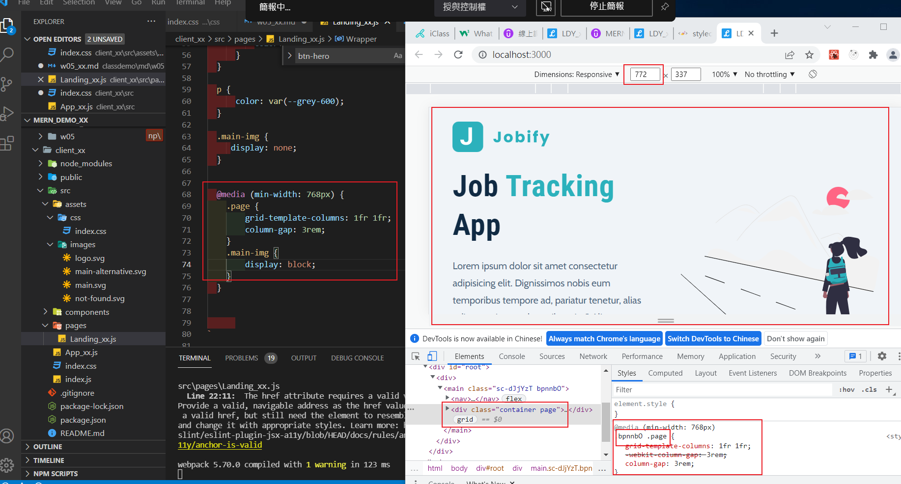

# Step 1: Initial Setup

### P1: P1: favicon & title using your English name initials

### P2: save initial setup to classdemo/w05/Step1_initial_setup

# Step 2: Add Landing_xx using styled components

### P3: styled components demo (2 buttons)

### P4: Landing_xx styled components with Responsive Design

