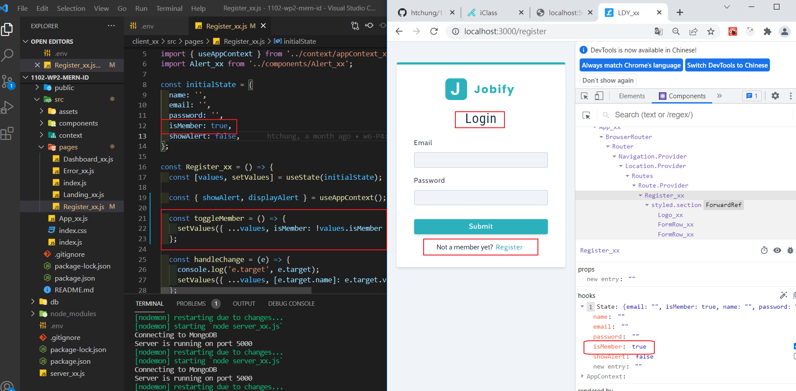
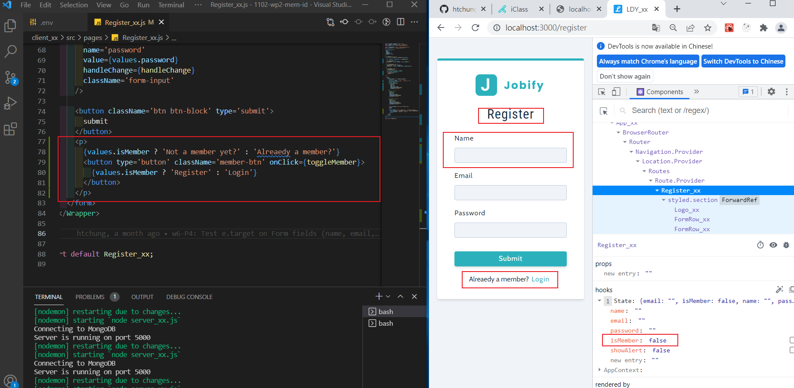
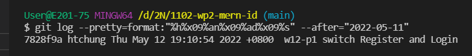
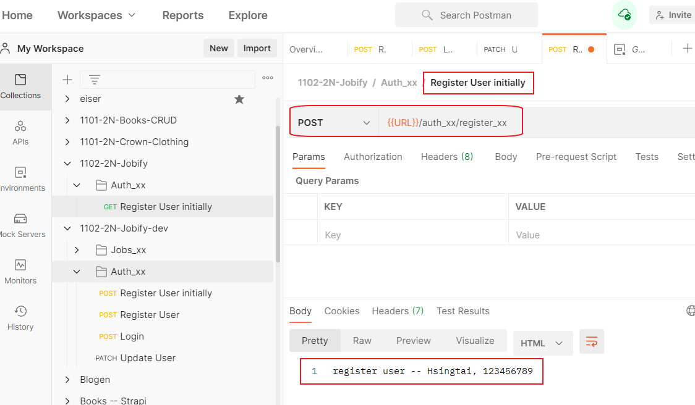
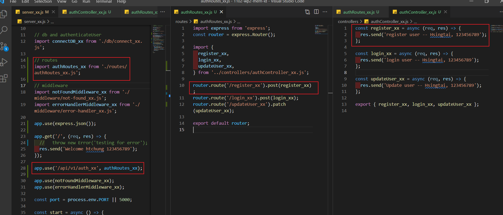
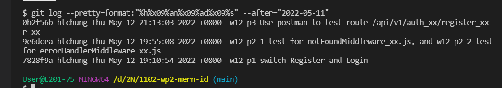

### w12-p1 switch Register and Login and log







### w12-p2-1 test for notFoundMiddleware_xx.js


### w12-p2-2 test for errorHandlerMiddleware_xx.js


### w12-p3 Use postman to test route /api/v1/auth_xx/register_xx





### w12-p4 Use postman to test route /api/v1/auth_xx/login_xx


### w12-p5 Use postman to test route /api/v1/auth_xx/updateUser_xx


### W12-LAST-LOG show all W12 log records in Github



```
$ git log --pretty=format:"%h%x09%an%x09%ad%x09%s" --after="2022-05-11"
0b2f56b htchung Thu May 12 21:13:03 2022 +0800  w12-p3 Use postman to test route /api/v1/auth_xx/register_xxr_xx
9e6dcea htchung Thu May 12 19:55:08 2022 +0800  w12-p2-1 test for notFoundMiddleware_xx.js, and w12-p2-2 test
for errorHandlerMiddleware_xx.js
7828f9a htchung Thu May 12 19:10:54 2022 +0800  w12-p1 switch Register and Login
```
