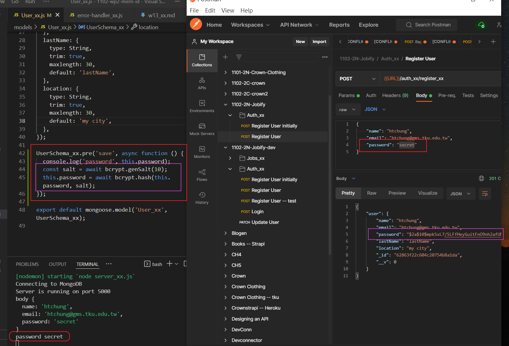
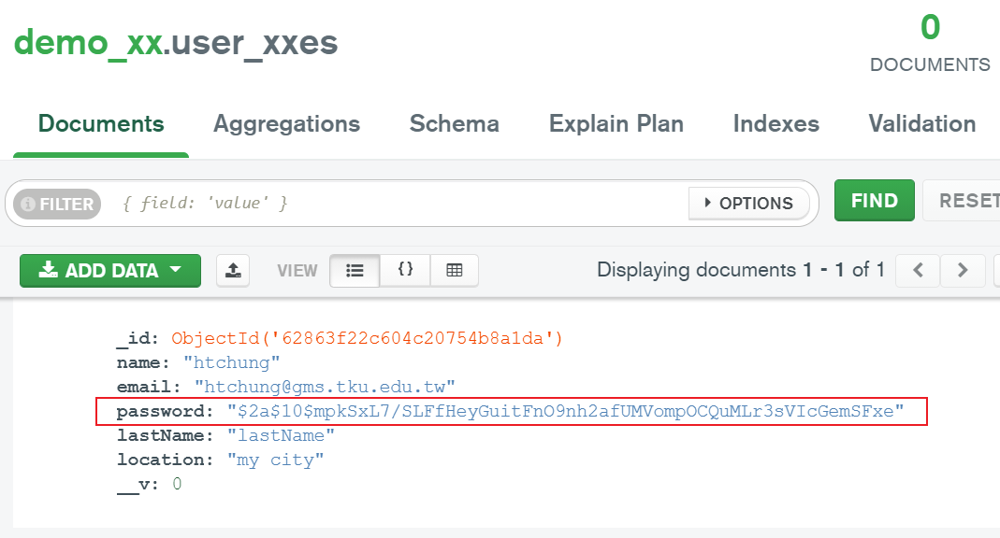
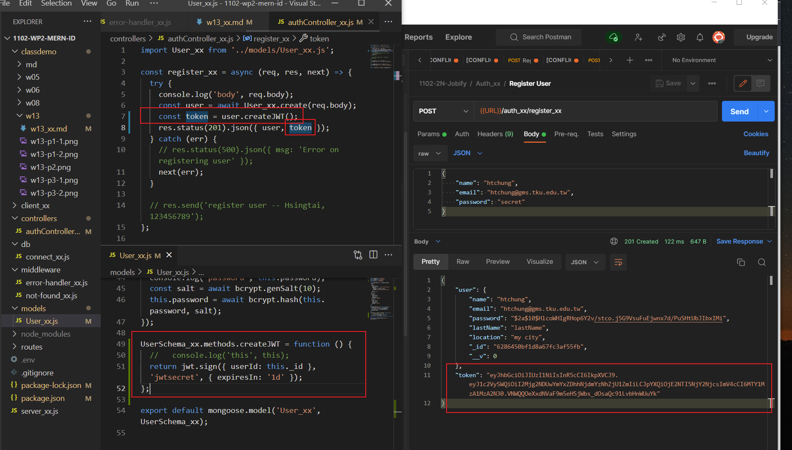
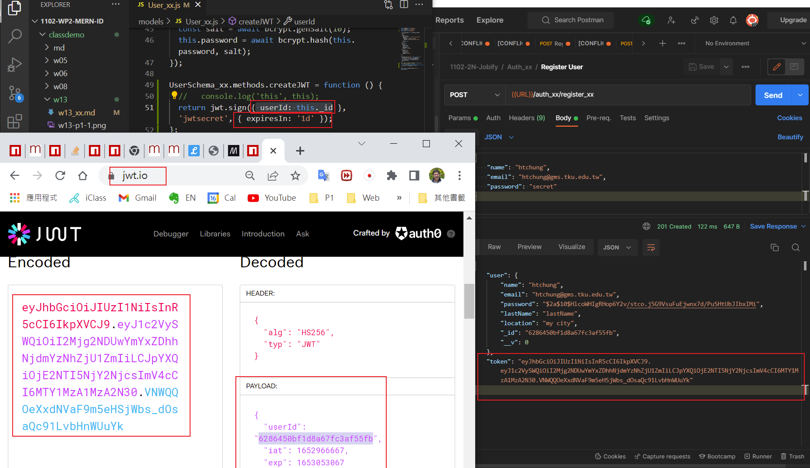

### Github repo URL

### w13-p1: create a user and save it into MongoDB, collection User_93


### w13-p2: use validator package to check email, error sent to error-handler_93.js


### w13-p3: hash password using bcryptjs





### w13-p4: create jwt token using bcryptjs





### p13-last-log

```

```
