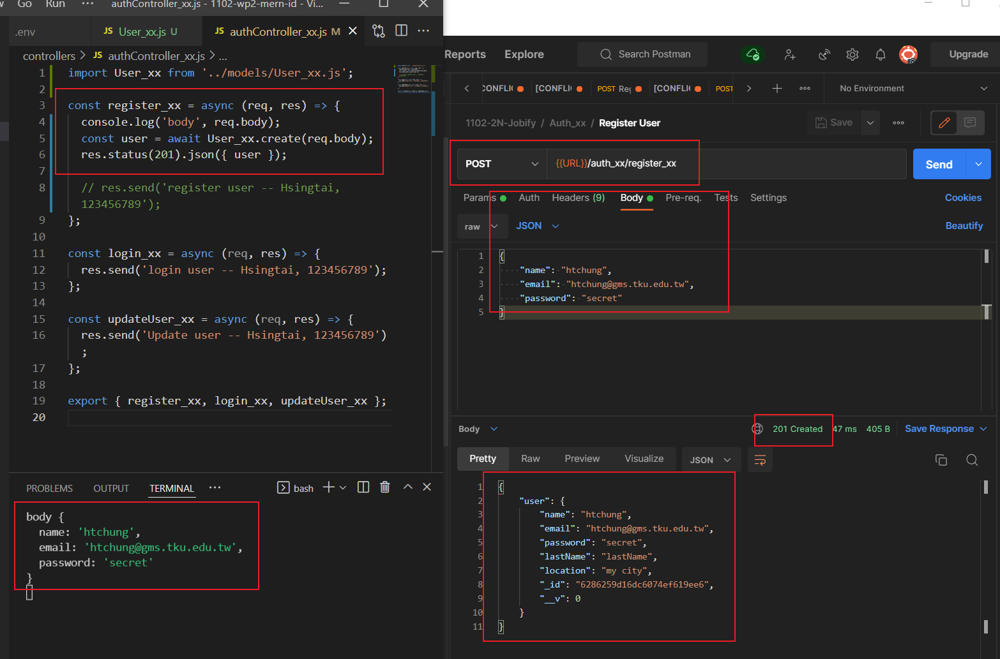
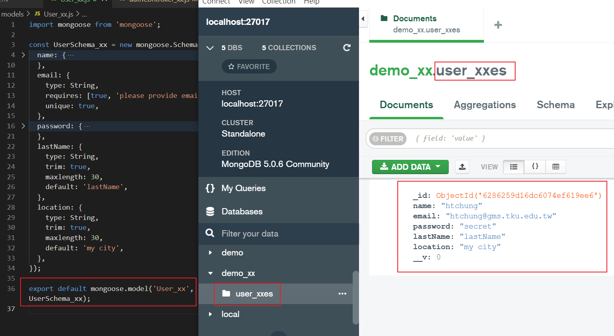
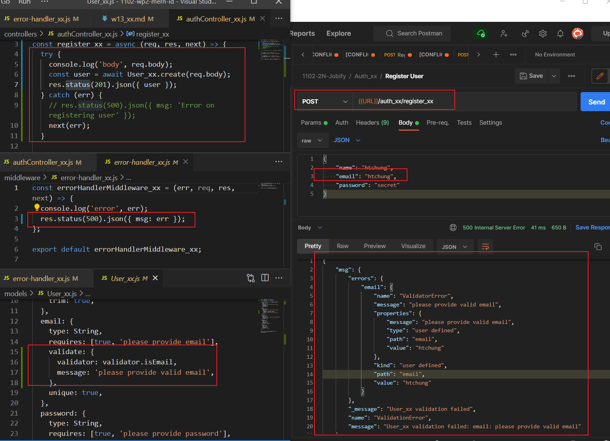

### Github repo URL

### w13-p1: create a user and save it into MongoDB, collection User_xx





### w13-p2: use validator package to check email, error sent to error-handler_xx.js



### p13-last-log

```
$ git log --pretty=format:"%h%x09%an%x09%ad%x09%s" --after="2022-05-18"
a14cb11 htchung Thu May 19 19:23:53 2022 +0800  w13-p1: create a user and save it into MongoDB, collection User_xx

```
