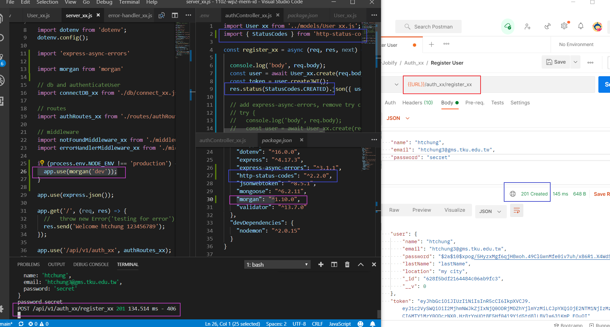
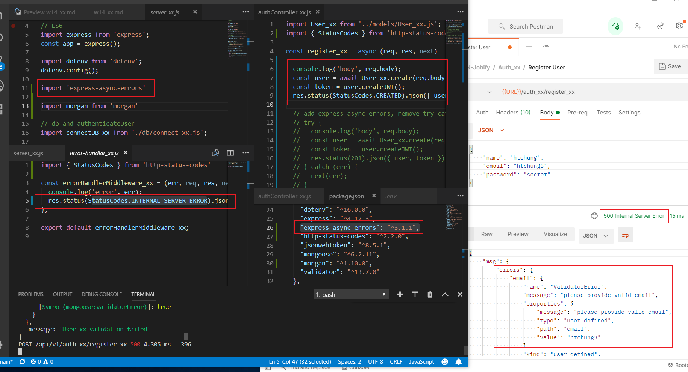

### Github repo URL

### w14-p1: install package http-status-codes, morgan, test it, and show it



### w14-p2: install express-async-errors and test it




### w13-p3: hash password using bcryptjs


### w13-p4: create jwt token using bcryptjs


### p13-last-log

```
$ git log --pretty=format:"%h%x09%an%x09%ad%x09%s" --after="2022-05-18"
a14cb11 htchung Thu May 19 19:23:53 2022 +0800  w13-p1: create a user and save it into MongoDB, collection User_xx

```
