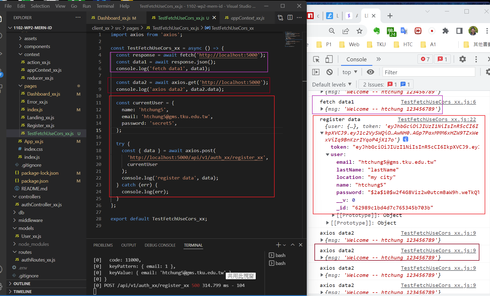
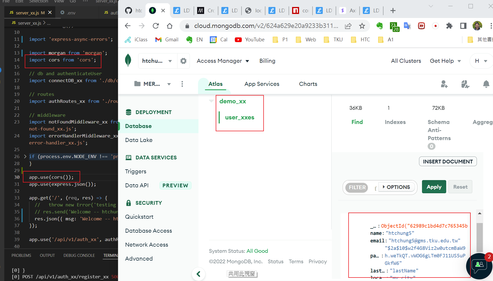
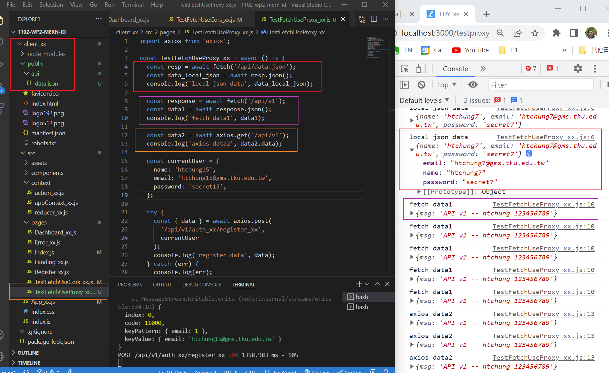
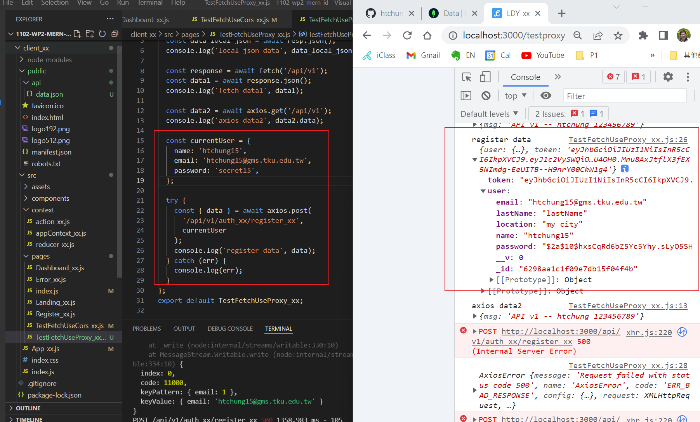
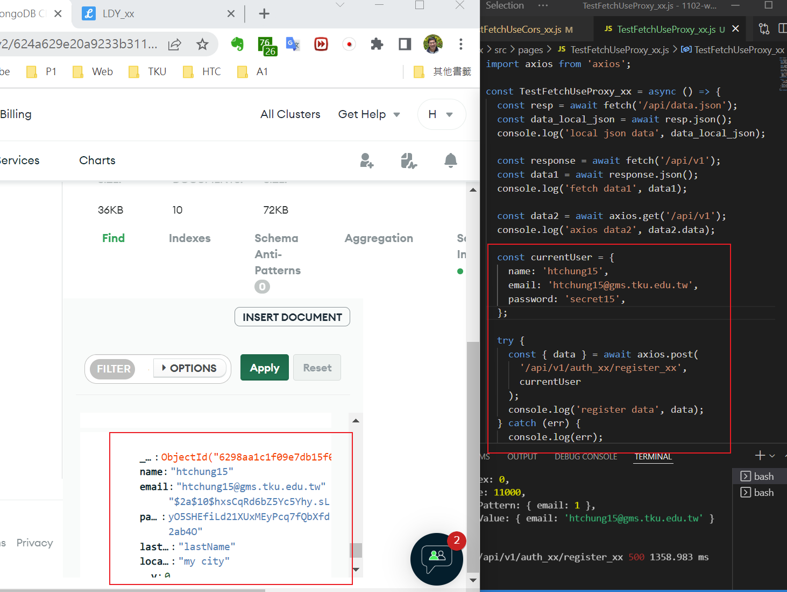

### Github repo URL

### w15-p1: client /testcore to test TestFetchUseCors_xx.js





### w15-p2: client /testproxy to test TestFetchUseProxy_xx.js







### p15-last-log

```
$ git log --pretty=format:"%h%x09%an%x09%ad%x09%s" --after="2022-06-01"
a14cb11 htchung Thu May 19 19:23:53 2022 +0800  w13-p1: create a user and save it into MongoDB, collection User_xx

```
