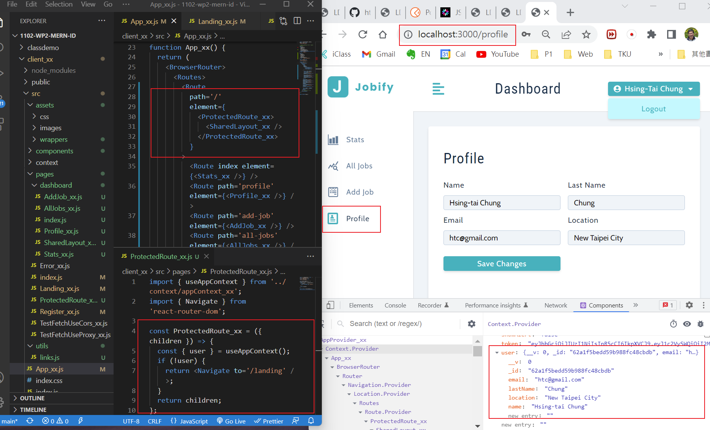
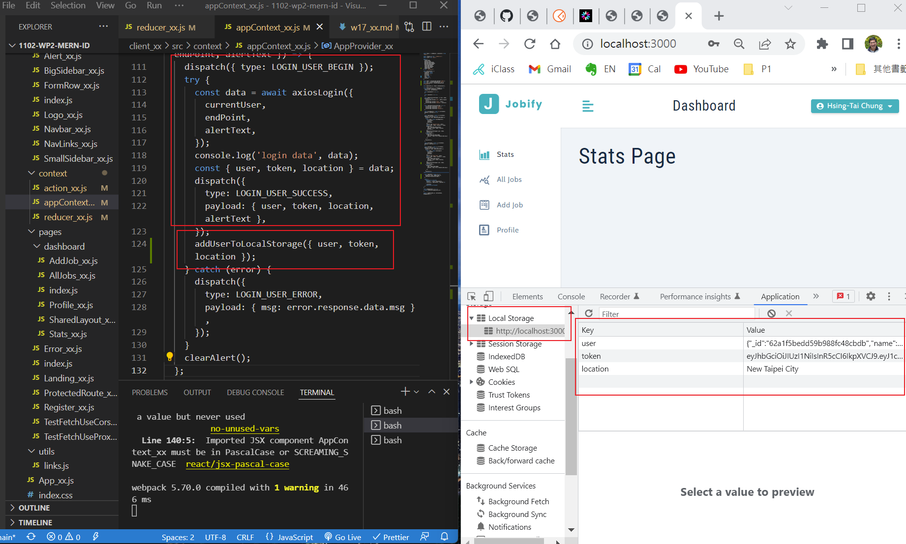
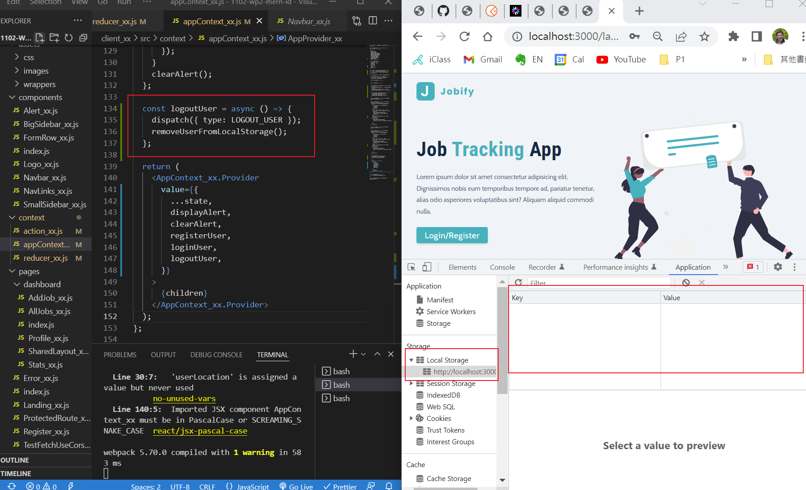
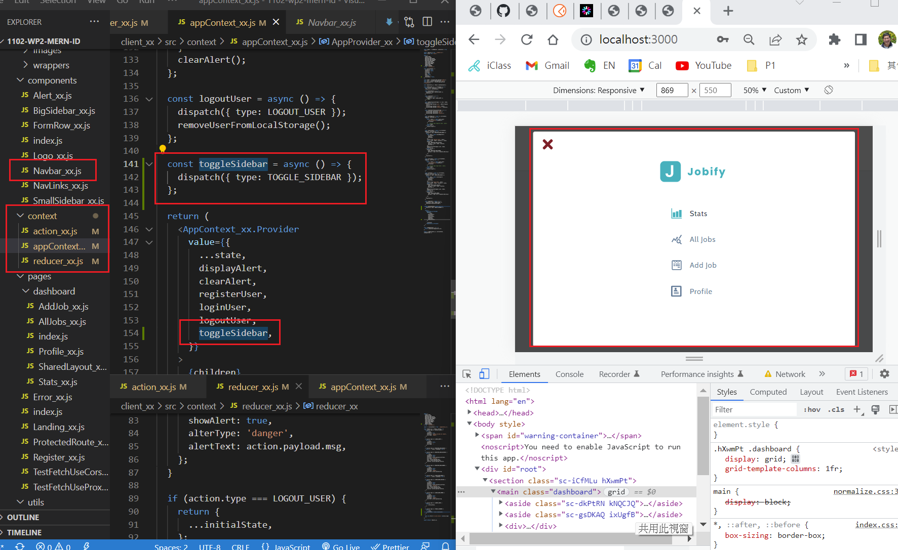
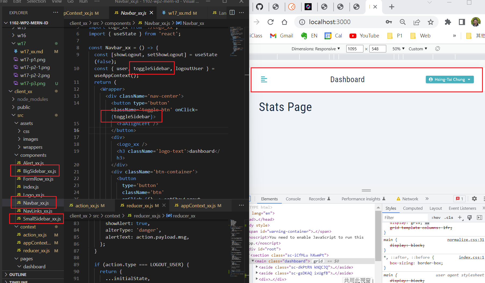
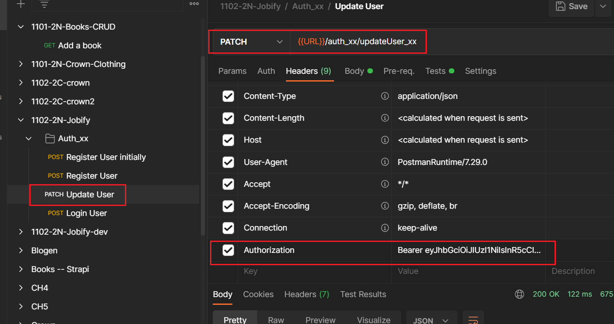
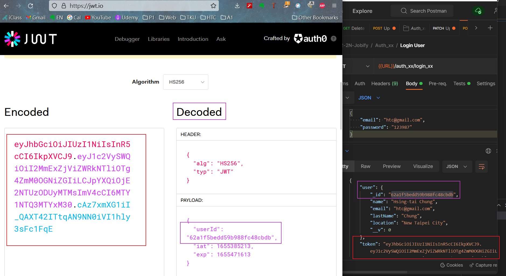
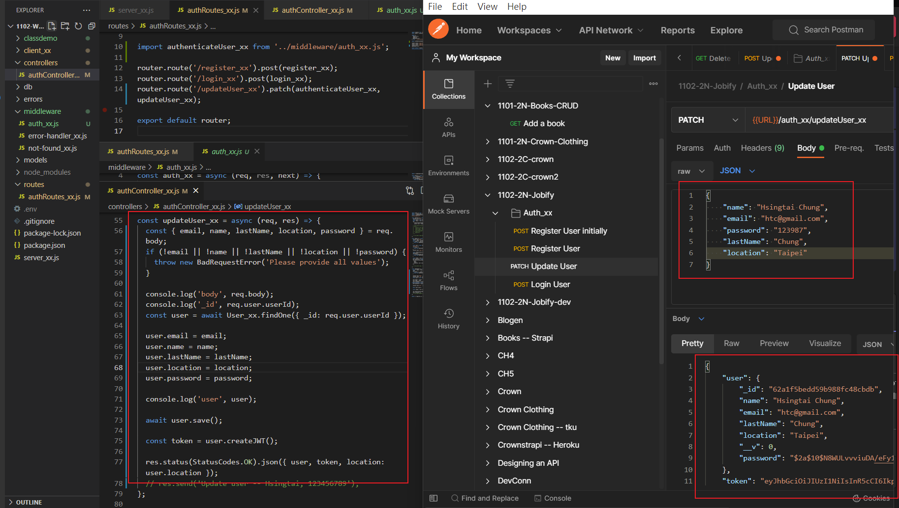

### Github repo URL

### w17-p1: after login in, direct to protected route of dashboard



### w17-p2: implement logout user, remove local stroage data





### w17-p3: toggle sidebar (SmallSidebar and BigSidebar)





### w17-p4: server authentication and updateUser








### p17-last-log

```
$ git log --pretty=format:"%h%x09%an%x09%ad%x09%s" --after="2022-06-15"
4e19987 htchung Thu Jun 16 21:47:00 2022 +0800  w17-p4: server authentication and updateUser
905d1da htchung Thu Jun 16 20:55:27 2022 +0800  w17-p3: toggle sidebar (SmallSidebar and BigSidebar)
93b41df htchung Thu Jun 16 20:31:10 2022 +0800  w17-p2: implement logout user, remove local stroage data
f8271ee htchung Thu Jun 16 19:32:20 2022 +0800  w17-p1: after login in, direct to protected route of dashboard

```
