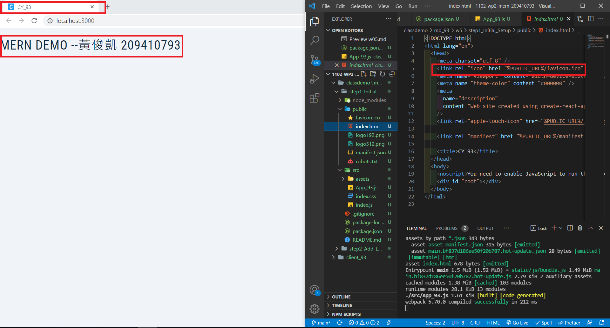
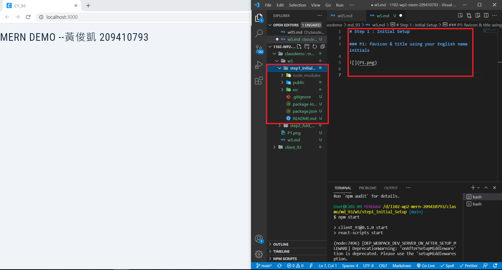

# Step 1 : Initial Setup

### P1: favicon & title using your English name initials

### P2 :

# Step 2 : Add Landing Page

### P3 : styled components demo (2 buttons)

### P4 : Landing_93 styled components with Responsive Design

### P5 : push w5 files to Github and show md

### P6 :share github

