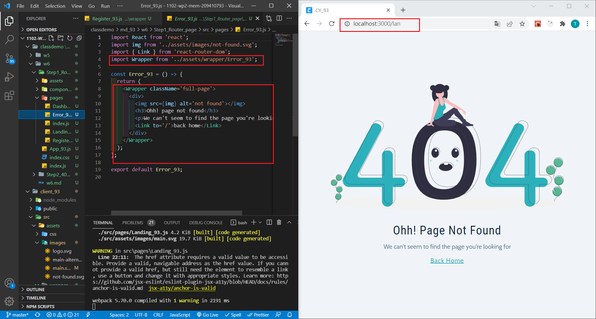

### P1: get a photo from undrow.co using color: var(--primary-500)

### P2: setup routes / for Dashboard, /landing for Landing page, /register for Register page

### w6-P3: implement 404 not found page

### w6-P4: Test e.target on Form fields (name, email, password)

